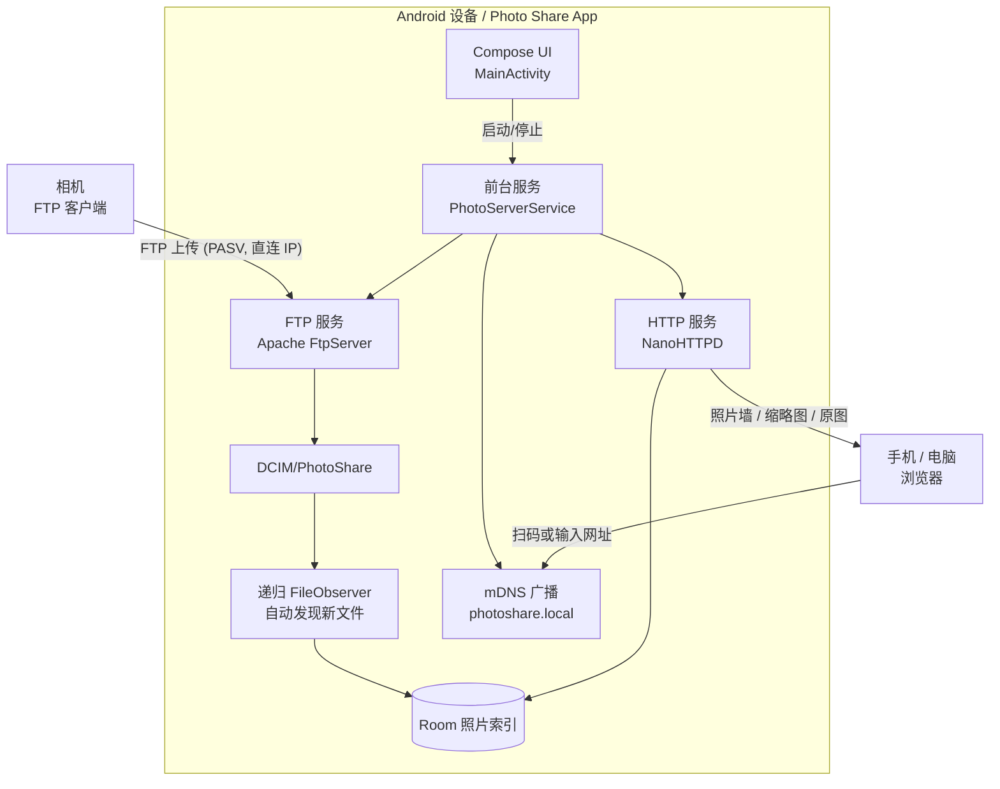

# 架构与数据流

**数据流**：相机 FTP 上传 → 写入 `DCIM/PhotoShare` → `FileObserver` 捕获新文件 → 生成缩略图并更新 Room 索引 → HTTP 照片墙实时拉取展示。

## 组件职责

- **PhotoServerService（前台服务）**：编排 FTP + HTTP + mDNS 的启停，持有唤醒锁（WakeLock）与高吞吐 Wi-Fi 锁（WifiLock）保证常驻；端口绑定失败时按候选列表自动回退。
- **FtpServerManager**：基于 Apache FtpServer 的单用户认证 FTP 服务，PASV 被动模式，上传生命周期回调驱动索引更新。
- **PhotoHttpServer**：基于 NanoHTTPD 的照片墙与 API 服务，提供分页列表、状态、缩略图、原图（支持 `Range` 断点续传）。
- **MdnsRegistrar**：基于 JmDNS 广播 `photoshare.local`，**仅注册 `_http._tcp`**；相机 FTP 上传不经 mDNS 域名，只用界面给出的直连 IP。IP 变化时自动重新广播。
- **PhotoRepository + Room**：照片索引仓库，启动对账 + 递归 `FileObserver` 自动发现新文件，配合缩略图生成。
- **PhotoServerApp**：应用级依赖容器，固定上传目录为 `DCIM/PhotoShare`。
